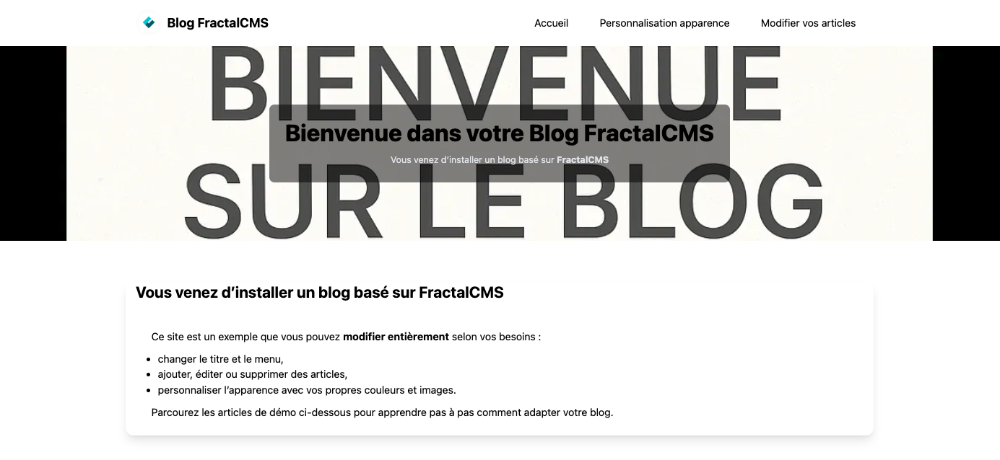

# FractalCMS – Blog clé en main

Exemple de projet basé sur FractalCMS – un Blog clé en main prêt à l’emploi.

👉 Ce projet est basé sur [FractalCMS](https://github.com/dghyse/fractal-cms).  
N’hésitez pas à consulter la documentation complète du CMS pour aller plus loin.

## Installation rapide 

Vous pouvez dès maintenant installer le projet

```bash
composer create-project dghyse/blog-fractal-cms mon-blog
cd mon-blog
composer install
```

FractalCMS est un CMS léger et modulaire développé en PHP (basé sur [YiiFramework 2.0](https://www.yiiframework.com/)).
Il propose un système simple et efficace pour créer rapidement des sites web.

Ce dépôt contient un preset “Blog” :

* Installation en 5 commandes,
* Création automatique des **tables, des menus et des articles**,
* Contenu de départ intégré : **une documentation directement lisible dans le blog**,
* Images, textes et structure prêts à l’emploi,
* Un **site clé en main** immédiatement fonctionnel après installation.

**Objectif** : fournir à l’utilisateur un site clé en main qu’il pourra ensuite personnaliser (contenu, apparence, configuration).


## Prérequis

⚡ L’application est prête à l’emploi dès installation.
L’utilisation de Node/NPM est optionnelle si vous souhaitez modifier ou recompiler les assets front-end (CSS/JS).

### Backend
* Php : >= 8.2
* [YiiFramework 2.0](https://www.yiiframework.com)
* Mysql / MariaDb

### Frontend
* Nodejs :v24.8.0
* Npm :11.6.0

### Build dist

### Init node modules For DEV
```bash
npm install
```
#### In dev
```bash
npm run watch
```
#### For production
```bash
npm run dist-clean
```
## Installation et configuration

### méthode 1

```bash
git clone https://github.com/dghyse/blog-fractal-cms.git
cd blog-fractal-cms
composer install
```

### Méthode 2

```bash
composer create-project dghyse/blog-fractal-cms mon-blog
cd mon-blog
composer install
```

## Init CMS For install Blog

## Config application

## Paramétrage Base de données

Add .env file on root project with your configuration

```dotenv
# prod | test | dev
YII_ENV=prod
# If debug is needed define YII DEBUG
YII_DEBUG=0
# If maintenance mode is needed define YII_MAINTENANCE
YII_MAINTENANCE=0
# Define the cookie validation key
YII_COOKIE_VALIDATION_KEY=XXX
# define the hostnames that are allowed to forward X-Forwarded-* header
# Application version
APP_VERSION=1.0.0
# Application mode
APP_ENV=prod

DB_PORT=3306
DB_HOST=localhost
DB_DATABASE=DatabaseName
DB_USER=user
DB_PASSWORD=pwd
DB_DRIVER=mysql
```

### Add module fractal-cms in config file

Ce site est près à l'emploi, le fichier **common.php** est déjà paramétré pour le fonctionnement
correct du site.


```bash
common/config/common.php
```
```bash

use fractalCms\Module as FractalCmsModule;
use yii\web\View as YiiView;
use fractalCms\components\View;

```

```bash 
  'container' => [
        'definitions' => [
            YiiView::class => View::class
        ],
        'singletons' => [
            CacheInterface::class => DummyCache::class,
            Connection::class => [
                'charset' => 'utf8',
                'dsn' => getstrenv('DB_DRIVER').':host=' . getstrenv('DB_HOST') . ';port=' . getstrenv('DB_PORT') . ';dbname=' . getstrenv('DB_DATABASE'),
                'username' => getstrenv('DB_USER'),
                'password' => getstrenv('DB_PASSWORD'),
                'tablePrefix' => getstrenv('DB_TABLE_PREFIX'),
                'enableSchemaCache' => getboolenv('DB_SCHEMA_CACHE'),
                'schemaCacheDuration' => getintenv('DB_SCHEMA_CACHE_DURATION'),
            ],
            \webapp\helpers\MenuBuilder::class => [
                'class' => \webapp\helpers\MenuBuilder::class
            ],
            //../..
        ]
    ],
    'bootstrap' => [
        'fractal-cms',
        //../..
    ],
    'modules' => [
        'fractal-cms' => [
            'class' => FractalCmsModule::class
        ],
        //../..
    ],
```


### 1 - Run migration

```bash
php yii.php migrate
```

### 2 - Create Rbac
```bash
php yii.php fractalCms:rbac/index
```
### 3 - Create Admin
```bash
php yii.php fractalCms:admin/create
```
### 4 - INIT content
```bash
php yii.php fractalCms:init/index
```
### 5 - Create Blog 

#### Génération automatique de contenus

```bash
php yii.php blog/build-cms-site
```

### Aperçu



### Contenu généré automatiquement

Lors de l’installation, FractalCMS crée automatiquement :

* Les menus et la navigation de base,
* Des articles et pages d’exemple,
* Des images de démonstration,
* La documentation de FractalCMS directement intégrée au blog.

**Attention** Ces contenus sont factices : ils servent uniquement de point de départ et de démonstration.
L’objectif est que vous disposiez immédiatement d’un site clé en main, fonctionnel, que vous pourrez ensuite personnaliser (modifier ou supprimer les articles, remplacer les images, changer les menus…).

-> Vous pouvez modifier ces contenus depuis l’administration.

[http://localhost:8080/fractal-cms](http://localhost:8080/fractal-cms)

### Résultat attendu

Une fois toutes les étapes terminées, ouvrez votre navigateur sur :  
[http://localhost:8080](http://localhost:8080)

Vous obtiendrez un **blog prêt à l’emploi** avec :
- une page d’accueil déjà configurée,
- des articles créés automatiquement,
- un menu généré,
- et une documentation intégrée directement dans le blog.

## 📄 Licence

Ce projet est distribué sous la licence MIT.  
Voir le fichier [LICENSE](LICENSE) pour plus d’informations.
